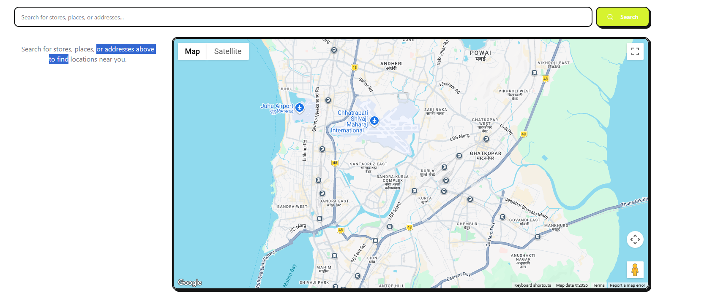
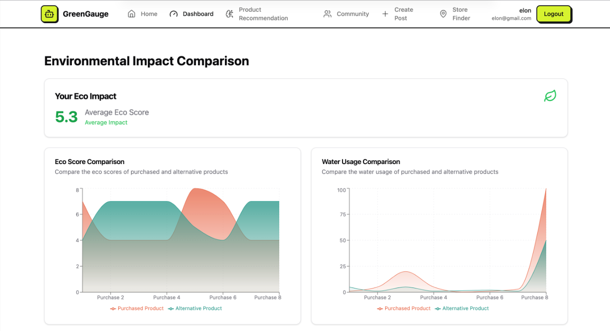
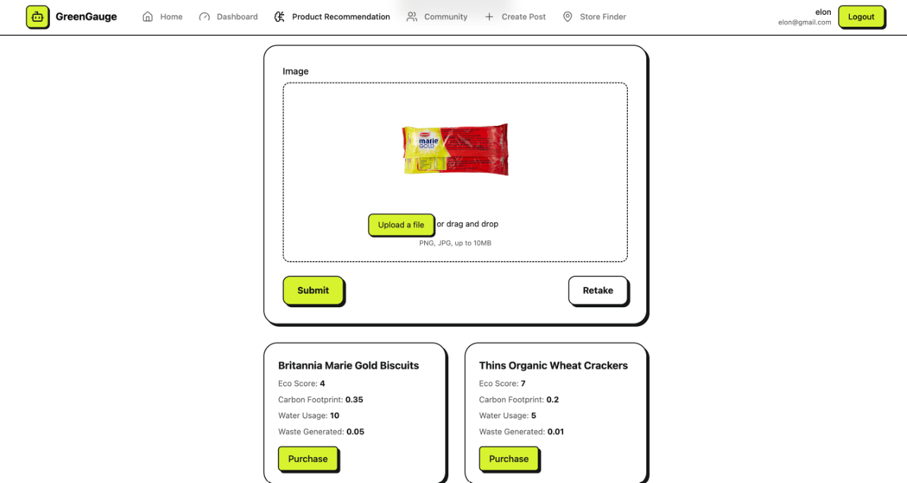
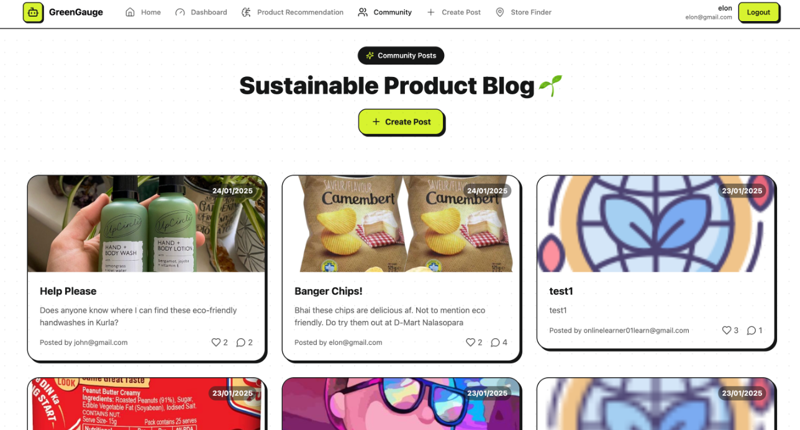
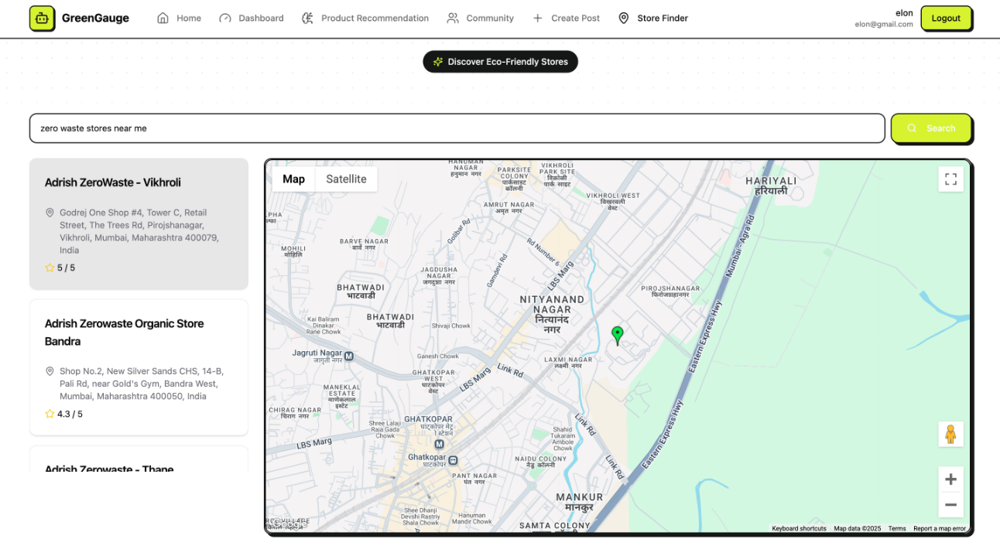

# GreenHack 🌱

> **2nd Runner-Up at RUBIX'25 Hackathon!** 🏆

An AI-powered sustainable shopping assistant that empowers users to make eco-friendly purchasing decisions, calculate carbon footprints, and discover zero-waste stores nearby. 



## 🚀 Features

- **AI Product Analysis**: Snap a photo of a product, and our Gemini-powered AI calculates its Eco-Score, carbon footprint, water usage, and suggests a greener alternative.
- **Eco-Score Leaderboard**: Gamify sustainability! Track your environmental impact and compete with friends.
- **Transaction History**: Visualize your positive environmental impact over time with stunning charts.
- **Zero-Waste Store Finder**: An integrated Google Maps interface to find nearby ethical shops, refill stations, and eco-friendly markets. (Dynamic fallback included for demo purposes).

## 📸 Screenshots

| Dashboard & Tracking | Eco-friendly Maps |
| :---: | :---: |
|  |  |

| AI Product Scanner | Community Feed |
| :---: | :---: |
|  |  |

## 🛠 Tech Stack

**Frontend:**
- Vite + React + TypeScript
- Tailwind CSS & Framer Motion for premium aesthetics
- Shadcn UI & Lucide Icons
- Google Maps JavaScript API

**Backend:**
- Node.js & Express.js
- MongoDB & Mongoose
- Google Generative AI (Gemini 2.5 Flash)
- JWT Authentication

## 🔧 Installation & Setup

1. **Clone the repository:**
   ```bash
   git clone https://github.com/Omkarop0808/GreenHack.git
   cd GreenHack
   ```

2. **Install dependencies:**
   ```bash
   # Install backend dependencies
   cd backend && npm install
   
   # Install frontend dependencies
   cd ../frontend && npm install
   ```

3. **Configure Environment Variables:**
   - Add `.env` in `backend/` with `MONGO_URI`, `JWT_SECRET`, `GEMINI_API_KEY`
   - Add `.env` in `frontend/` with `VITE_GOOGLE_MAPS_API_KEY`

4. **Run Locally:**
   - Backend: `npm start`
   - Frontend: `npm run dev`

## ☁️ Deployment

This project is configured as a Monorepo for easy deployment on **Vercel**:
- Vercel handles the Frontend via `@vercel/vite`.
- Vercel automatically deploys the Backend Express app as Serverless Functions (`@vercel/node`) via `vercel.json` rewrites.
